<picture>
  <source media="(prefers-color-scheme: dark)" srcset="dark.svg">
  <source media="(prefers-color-scheme: light)" srcset="light.svg">
  
</picture>

## About Me

Hi 👋, I'm **Dominic Biyasha** — a B.E. Computer Science and Engineering (AI & ML) student at KGiSL Institute of Technology, based in Coimbatore, India. I build AI-assisted tools, clean data pipelines, and responsive web interfaces.

## 🛠️ Skills

| Skill | Proficiency |
|---|---|
| HTML | ████████████████████░ 95% |
| CSS | ███████████████████░░ 90% |
| Python | ██████████████████░░░ 88% |
| Git & GitHub | █████████████████░░░░ 85% |
| SQL | █████████████████░░░░ 80% |

## 🎓 Education

| Year | Qualification | Institution |
|---|---|---|
| 2025 – 2029 | B.E. Computer Science and Engineering (AI & ML) | KGiSL Institute of Technology |
| 2024 | HSC (12th Standard) | Holy Cross Anglo-Indian Higher Secondary School |
| 2022 | SSLC (10th Standard) | Holy Cross Anglo-Indian Higher Secondary School |

## 📜 Certificates

- **Build Your Own Static Website** — NxtWave CCBP 4.0 Academy · November 2025
- **Build Your Own Responsive Website** — NxtWave CCBP 4.0 Academy · January 2026
- **Introduction to Databases (SQL)** — NxtWave CCBP 4.0 Academy · April 2026
- **Python Programming** — CSC Computer Education · 2024
- **STEM Project Expo** — Third Prize, KGiSL Institute of Technology · 2026
- **PyExpo 2026** — Participation Certificate · 2026

## 🚀 Projects

### PyXcel Automator
An AI-powered desktop application that automates Excel operations — cleaning datasets, merging sheets, sorting, filtering, report generation, and smart data visualization through an easy-to-use interface.

`✓ Data Cleaning` `✓ Excel Merge` `✓ Sort & Filter` `✓ Charts` `✓ AI Automation`

**Tech stack:** Python · Pandas · PySide6 · Git

🔗 [github.com/Biyasha/PyXcel](https://github.com/Biyasha/PyXcel.git)

## 📫 Contact

| | |
|---|---|
| 📧 Email | [dominicbiyasha@gmail.com](mailto:dominicbiyasha@gmail.com) |
| 📱 Phone | [+91 7397110457](tel:+917397110457) |
| 📍 Location | Coimbatore, India |
| 💼 GitHub | [github.com/Biyasha](https://github.com/Biyasha) |
| 🔗 LinkedIn | [linkedin.com/in/dominic-biyasha](https://www.linkedin.com/in/dominic-biyasha/) |
| 🐦 Twitter/X | [x.com/DBiyasha](https://x.com/DBiyasha) |

---

Banner auto-switches between <code>dark.svg</code> and <code>light.svg</code> based on GitHub's theme — keep all three files in the same folder.

